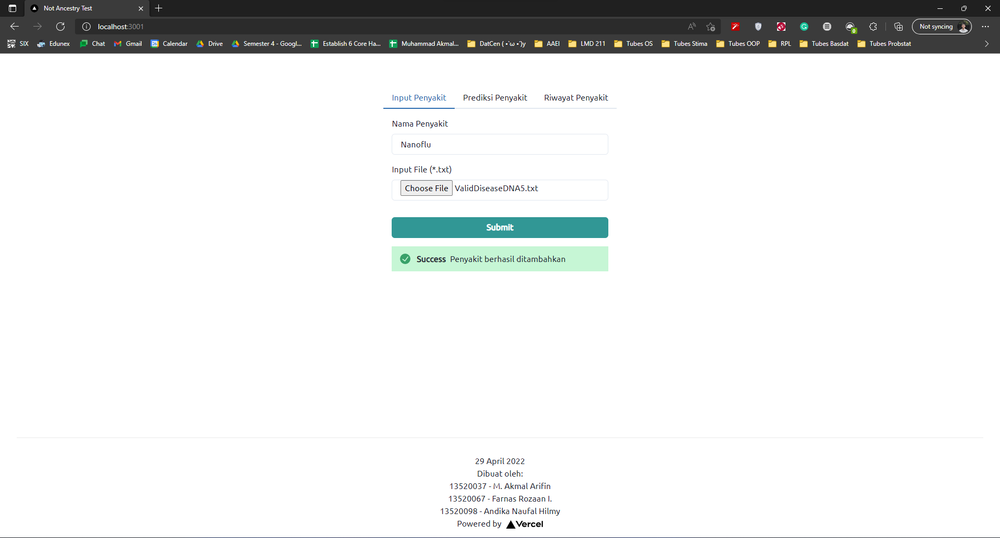
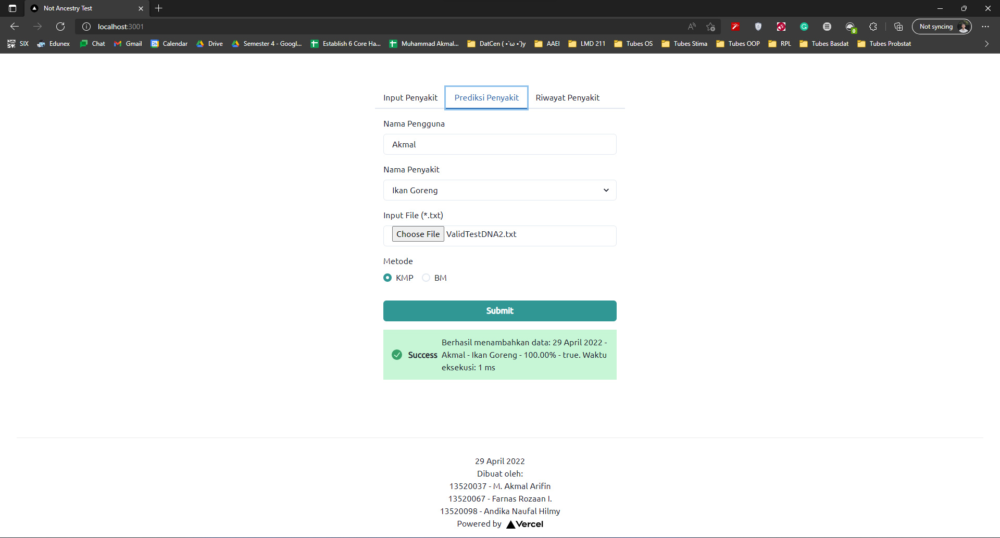
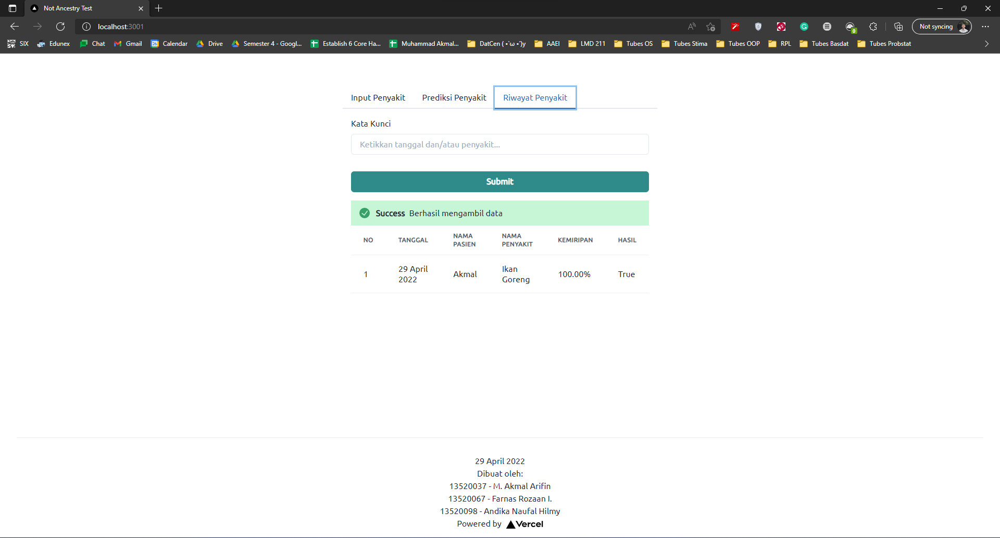

# DNA Pattern Matching
> This small project is created for IF2211 Algorithm Strategies assignment. This project is about pattern matching for detecting diseases by checking the similiarity of the DNA. It will required the DNA of the disease and the patient. It will show the similiriaty of DNA diseases in the patient's DNA.
> Live demo [_here_](https://tubes3-stima-five.vercel.app/). <!-- If you have the project hosted somewhere, include the link here. -->

## Table of Contents
* [General Info](#general-information)
* [Technologies Used](#technologies-used)
* [Features](#features)
* [Screenshots](#screenshots)
* [Setup](#setup)
* [Usage](#usage)
* [Project Status](#project-status)
* [Room for Improvement](#room-for-improvement)
* [Acknowledgements](#acknowledgements)
* [Contact](#contact)
<!-- * [License](#license) -->


## General Information
This project is about String Matching and Regular Expression. String Matching and Regular Expression are used for DNA Pattern Matching to predict patient disease by looking at its DNA. The algorithm that been used for String Matching are Knuth-Morris-Pratt algorithm and Boyer-Moore algorithm. You can choose one of them in the web application. This project is one of the assignment that given in IF2211 Algorithm Strategies.

## Features
List the ready features here:
- Input Disease
- Predict Disease
- History


## Screenshots
<details>
  <summary>Input Disease</summary>
  
 </details>
 <details>
  <summary>Predict Disease</summary>
  
 </details>
 <details>
  <summary>History</summary>
  
 </details>
<!-- If you have screenshots you'd like to share, include them here. -->


## Setup
To run this web application on your local follow this steps:
1. Clone this repository
2. Open the folder using Command Promt
3. Run ```cd src```
4. Run ```npm install```, wait until the installation is completed
5. Run ```yarn run dev```
6. Open your browser, and go to (localhost:3000)

## Project Status
Project is: _complete_

## Authors
* **Muhammad Akmal Arifin** - *13520037*
* **Farnas Rozaan I.** - *13520067*
* **Andika Naufal Hilmy** - *13520098*
